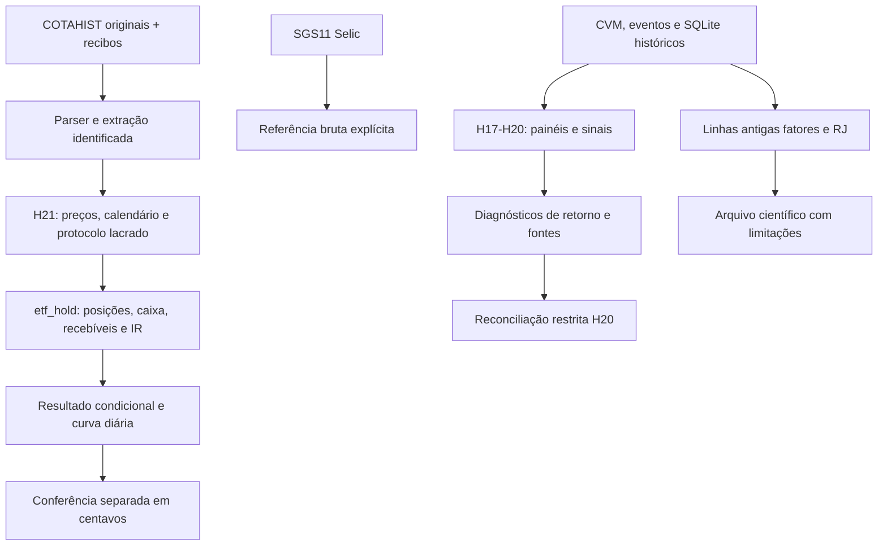

# Auditoria técnica e econômica integral — Stocks Predictor

**AUDIT-R3, 10/09/2026 UTC (09/09 à noite em São Paulo).** Mandato executado individualmente, sem subagentes. Base observada: `3f9b891bfc48f38a36fa7f5405547b85ca76b317`, após PR73. Correções de domínio validadas no commit `c1f99b67025c0c013527c3a71c458f1d32d59fe0`, pela [CI197](https://github.com/leonardosovienski/stocks-predictor/actions/runs/34425217407). Integração desta entrega e check do último commit: [PR74](https://github.com/leonardosovienski/stocks-predictor/pull/74). O recibo final em `C:\STOCKS\outputs\AUDITORIA_INTEGRAL_20260910\ENTREGA.json` registra o SHA efetivamente integrado.

**Resultado central:** o projeto consegue reproduzir uma simulação histórica condicional de compra e manutenção de BOVA11. Não demonstrou lucro futuro, lucro integral executável, vantagem ajustada ao risco ou adequação a uma conta pessoal. A auditoria corrigiu defeitos reais de entrada, temporalidade, persistência, classificação de fontes e inferência estatística. O H21 continua sendo o caminho de validação mais justificável **entre os examinados**, por exigir menos reconstrução e funcionar como baseline simples. A evidência não justifica retomar a reconstrução ampla de H20 neste momento.

Ponto de entrada: este relatório. [Registro canônico](registry.json): 22 claims, 16 achados/lacunas, 24 frentes, decisões, dados, usos, execuções e evidências com SHA-256. Os IDs nas tabelas abaixo referem-se a esse registro; não são novas filas de pendências. [Comandos de reprodução e verificação](../../../research/session-20260910/integral/README.md). [Mandato completo](../../continuation/PROMPT_AUDITORIA_INTEGRAL_20260909.md).

## A — O que existe e está correto

- **Preservação e identidade:** 1.356 arquivos rastreados na base inventariados; um checkout. Os 12 SQLite recuperados passaram por hash, `integrity_check` e `foreign_key_check`, sem alteração após leitura. Os seis lacres externos selecionados e os bancos foram reconferidos ao final das execuções. Isso prova integridade física no escopo, não completude econômica. E02, E19, E29.
- **H21:** extração real de nove COTAHIST, protocolo lacrado, oito simulações e verificação separada em centavos funcionam. Reproduzidos os oito livros, 16.400 pontos diários e referência Selic. Os arquivos de preços e linhas originais são byte a byte iguais após o endurecimento do parser. E10, E11, E18.
- **Separação contábil:** posição, saldo disponível, recebível de liquidação e obrigação fiscal são distintos no H21; IRRF é crédito da obrigação total, não um segundo imposto. Despesas internas do fundo incorporadas à cota não são deduzidas novamente do investidor. O verificador separado confere os valores modelados; não prova a ocorrência de uma operação. E11.
- **H20 restrito:** 32 sinais congelados reconstituídos com todos os campos iguais; 96 snapshots de características e 11 arquivos DFP relidos. As entradas econômicas consumidas permitem reconciliar 9.732 células de direitos, 12 cenários subjacentes e 18 cenários de estratégia. O pacote histórico integral permanece incompleto. E16, E28.
- **Distribuição de software:** CI197 passou com **815 testes, seis subtestes, Ruff, Pyright, build, wheel instalado fora do checkout e busca de segredos**. Cobertura reportada: 78%, incluindo ramos. O limiar configurado de cobertura é zero; 78% é uma medição, não um gate de qualidade aprovado por atingir uma meta.

## B — O que estava errado, frágil ou incompleto

Cada achado abaixo liga evidência, interpretação, efeito, ação e validação. Os detalhes estruturados, necessidade e condição de resolução estão nos registros I01–I16.

| Achado | Evidência observada e consequência | Correção efetiva | Validação |
|---|---|---|---|
| I01 — COTAHIST | Aceitava data impossível e registro com 217 colunas; fator zero não era rejeitado. Um preço aparentemente válido podia ter base/data inválida. | Exigir exatamente 245 colunas, data de calendário real e fator positivo; erro isolado é contado. | Regressões antes/depois; 2.050 entradas reais e livros H21 preservados. |
| I02 — Universo | `resolved_at` futuro liberava quarentena no passado. Nas seis datas fixas examinadas, o universo novo removeu 3, 5, 16, 21, 21 e 0 membros, respectivamente. | Resolução precisa preceder estritamente o corte. Caminho `legacy` explícito mantém semântica antiga nos reprodutores congelados. | Testes e amostra real E16; não se recalculou retorno H1–H16. |
| I03 — Snapshot | `INSERT OR IGNORE` permitia composição acumulada e retorno incompatível com o banco na repetição. | Comparação de composição/volume/rank, savepoint e erro em conflito; snapshot vazio é rejeitado porque o esquema não consegue identificá-lo. | Idempotência, conflito, rollback e preservação da transação do chamador. |
| I04 — Fonte | Hash desconhecido sem tipo virava fonte primária. Identidade não prova origem nem conteúdo. | Omissão agora é `UNCLASSIFIED`; tipo explícito continua exigindo exame semântico. | Teste negativo e auditorias 13/14 idênticas. Fixture incompatível apareceu na CI195 e foi corrigida. |
| I05 — Paper | Data passada e dados futuros podiam ser chamados de forward; worker legado tinha caminho periódico. | Data UTC corrente, bloqueio de preços posteriores, API histórica explicitamente legada e worker inativo. | Três regressões de contexto temporal e manutenção das fixtures históricas. Nenhuma observação foi criada. |
| I06 — Continuidade | CLI/plugin ainda apontavam H19 e instrução de ambiente desatualizada. | H21 condicional e restrições Windows corretas; pontos de entrada atualizados. | Inspeção, suíte e diff. |
| I07 — Gate econômico | Removia NaN silenciosamente e aceitava limiares/estimativas não finitos. | Rejeição explícita de dados/políticas inválidos; documentação limita pressupostos estatísticos e maturidade. | Quatro métodos falharam antes, passaram depois. |
| I08 — Estatística RJ | Bootstrap por empresa não torna válida permutação de episódios repetidos. Max-T aceitava famílias com amostras/grupos diferentes. | Guardas de unidade e alinhamento; secundária repetida preserva episódios, mas não produz inferência. | Três contraexemplos antes/depois; CI196 revelou a chamada integrada faltante, corrigida e aprovada na CI197. |

A afirmação “todas as `fundamentals_pit` estão vazias” também foi refutada: o banco de **reparo de exemplo tem três linhas**. As linhas não conferem suficiência ao acervo real. A correção está no estado corrente; o relatório R2 e seus bytes permanecem como registro datado.

As correções não tornam o sistema inteiro imune a leakage. `resolved_at` resolve uma fronteira específica; continuam faltando versões de disponibilidade de todas as fontes, identidade corporativa por intervalo e certificação ampla de eventos. Não promovemos ausência de defeito nos testes a prova universal.

## C — O que faltava e precisava ser construído

Foi criado [reconcile_h20.py](../../../research/session-20260910/integral/reconcile_h20.py), um verificador separado das **entradas consumidas**. O verificador integral original exige 1.448 arquivos, dos quais cinco não foram recuperados. Pular esse gate ou alterar o manifesto fabricaria um certificado. A nova ferramenta extrai objetos por SHA, conserva lacres e distingue o resultado econômico reproduzido do backup incompleto (I09/I15, D07).

A ferramenta reconcilia médias, trajetórias, diferenças pareadas, duas metades e intervalos registrados. Conferiu 465 médias transversais, 30 trajetórias, 54 comparações de médias/metades e 54 comparações de intervalos (27 intervalos únicos reutilizados em dois níveis de custo). Não são 54 amostras independentes. O cálculo separado usa `math.fsum`/`prod` e a rotina bootstrap congelada para a reprodução histórica, sem substituir o Core de produção.

Foram acrescentadas regressões de falhas materiais e um [verificador do pacote de auditoria](../../../research/session-20260910/integral/verify_audit.py). Este valida hashes, referências e contagens dos recibos publicados; não certifica por si só a interpretação econômica. O registro único elimina a necessidade de múltiplas listas contraditórias de pendências.

## D — O que não existe e não é necessário

**NÃO APLICÁVEL — COM JUSTIFICATIVA**, no caminho econômico avaliado (D05):

| Componente | Por que não foi construído | Quando a avaliação mudaria |
|---|---|---|
| ML supervisionado, feature store, treino distribuído/GPU | H21 tem ativo e regras predeterminados; não estima um modelo. Ausência de treino não é defeito. | Hipótese preditiva nova, benefício incremental e amostra apropriada registrados previamente. |
| Frontend, API de produto, microserviços e Kubernetes | Arquivos, protocolo e CLI já executam o fluxo necessário. Adicionariam manutenção sem capacidade econômica demonstrada. | Necessidade real de multiusuário, serviço ou volume operacional demonstrada. |
| Integração de ordens e baixa latência | Duas operações históricas de exposição simples não exigem HFT; operação real não está autorizada. | Mandato operacional específico e requisitos de execução comprovados. |
| Novo programa de tuning/novas estratégias para “salvar” H20 | Incremento econômico não demonstrado e dados incompletos não justificam busca ilimitada. | Hipótese distinta, orçamento, dados e teste futuro suficientes. |
| Novo inferidor por clusters para a linha RJ arquivada | Não é necessário para o H21; a chamada estatística sem suporte foi bloqueada. | Retomada justificada de RJ sob protocolo novo. A secundária atual não ganha validade por estar dispensada a reconstrução. |

Eventos, despesas reais, dados temporais e observações futuras **não** foram classificados como não aplicáveis aos claims que dependem deles. Permanecem lacunas explícitas.

## E — O que continua ausente e necessário

O backlog único da seção O contém I10–I16. As principais conclusões impedidas são: lucro integral executável, adequação pessoal, evidência futura e certificado integral do pacote H20. A recuperação documental não foi confundida com cobertura completa.

AUDIT-R3 foi registrada antes das coletas, separada de R1/R2 encerradas: teto de 20 consultas/aberturas dirigidas, 12 aquisições, duas tentativas por recurso/rota, 100 MB novos e 90 minutos de coleta. Foram registradas oito tentativas de aquisição, sete respostas salvas, menos de 1 MB novo, cinco corpos úteis ou relevantes; os outros dois eram redirecionamento de norma e HTML do visualizador FNET. A aquisição parou após responder questões delimitadas e atingir duas tentativas para FNET941503. Não houve ampliação do orçamento, novas hipóteses econômicas ou novas janelas de retorno. E01/E22.

FNET941503: primeira tentativa terminou em timeout; segunda trouxe HTML, não PDF. HTTP200 não foi tratado como documento obtido. A IN1585 também devolveu somente uma página de redirecionamento; seu corpo não foi certificado. A página primária da Receita sobre isenções foi obtida e lida em substituição para a proposição pertinente.

## F — Mapa final do sistema

| Subsistema / entradas | Declarado versus encontrado | Necessidade e estado validado |
|---|---|---|
| `main.py`, configuração, plugin, relatórios | CLI histórica e estado do domínio; não é um produto de previsão operacional. | Manutenção necessária; status corrigido. Comandos de ingestão podem escrever e não foram usados em bancos originais. |
| `cotahist`, ingestores, `db`, `adjust`, `universe` | Parsing, SQLite, quarentena e universo; banco não assegura PIT por conter datas. | Necessários à pesquisa de ações; contratos corrigidos e bancos auditados. Sem banco operacional ativado. |
| `factor`, `analyst`, `portfolio`, `backtest`, `returns` | Estratégias e walk-forward históricos. Pesos diários fixos, preços sem todos os fluxos e tratamento de faltantes limitam interpretação. | Preservados para reprodução histórica, não usados para seleção nova ou certificado de lucro. |
| `cvm_pit`, `disclosed_accounting`, `value_profitability`, `discovery_*` | Reconstrução documental, elegibilidade e hipóteses H17–H20. | 11 DFPs/750 chaves e 32 sinais H20 conferidos; não certificado geral de known_at/identidade. |
| `retail_cash`, `continuous_cash`, `simulation`, `cash_events`, `stock_events` | Motores distinguem posição/caixa/obrigações sob entradas fornecidas. | Testes verificam casos; fontes insuficientes impedem demonstração integral ampla. Implementação não é dados preenchidos. |
| `h20_checked`, `h20_continuous`, `h20_research`, `profit_validation` | Há checagens, simulação e diagnósticos. Um comando de prontidão não equivale a executar contabilidade integral. | H20 consumido reconciliado; reconstrução ampla estacionada. |
| `etf_hold` + `research/session-20260909/h21` | Runner determinístico de exposição simples, sem treinamento nem SQLite. | Fluxo real executado nesta auditoria e conferido de ponta a ponta. |
| `source_closure`, `cash_source_audit`, `source_history`, `document_panel` | Classificação, lacunas e suporte documental, não certificados automáticos por hash. | Auditorias 13/14 repetidas; omissão de tipo corrigida. |
| `rj_*` | Episódios, famílias, censura, inferência e pipeline de linha histórica. | Contratos estatísticos corrigidos; primária testada. Secundária repetida não produz inferência válida. |
| `economic_gate`, `buffered_rebalance`, `entry_feasibility`, `execution`, `trials_gate` | Componentes de política e viabilidade; presença não demonstra vantagem nem integração operacional ativa. | Entradas não finitas bloqueadas; uso depende de maturidade, custos e protocolo. |
| `paper` | Registro legado confundível com observação prospectiva. | Guardado e worker inativo; sem ledger forward certificado ou operação nesta rodada. |

**População examinada:** inventário de identidade/AST de 55 arquivos Python: 54 do pacote e `main.py`. Leitura semântica aprofundada foi dirigida a entradas, tempo, contabilidade, reprodução e estatística; demais módulos tiveram mapa de funções/imports e cobertura da suíte/fluxos pertinentes. Seleção pelo impacto econômico e caminhos ativos, não amostra aleatória. Não alegamos revisão exaustiva de cada linha, de cada estratégia arquivada ou de todas as combinações possíveis. E21 lista os arquivos; a seção L explicita exclusões dos checks.

## G — Matriz final de claims

| ID / natureza | Proposição | Estado / escopo | Evidência |
|---|---|---|---|
| C01 / FATO | SHA antigo do prompt é o HEAD corrente | REFUTADO. Base real 3 f 9 b 891 bfc 48 f 38 a 36 fa 7 f 5405547 b 85 ca 76 b 317, PR73; integração desta auditoria via PR74. | E29 |
| C02 / FATO | Os 12 bancos recuperados estão íntegros e preservados | VALIDADO. SHA físico, PRAGMA integrity_check e foreign_key_check; não certifica semântica ou prontidão. | E02, E19 |
| C03 / FATO | Todas as tabelas fundamentals_pit estão vazias | REFUTADO. O reparo de exemplo contém 3 linhas. Não há painel PIT amplo certificado. | E02 |
| C04 / FATO | H21 reproduz os oito resultados históricos | VALIDADO. 2050 preços, 16400 pontos diários; entradas e campos econômicos exatos. Metadados de execução diferem. | E10, E11, E18 |
| C05 / HIPÓTESE | O ganho H21 demonstra lucro integral executável ou futuro | NÃO SUSTENTADO. Lucro histórico condicional após custos/IR modelados; despesas reais e cobertura integral de eventos não fechadas. | E11, E20, E22 |
| C06 / FATO | Fontes 13/14 são reproduzíveis e suficientes | LIMITADO. Auditorias reproduzidas exatamente; ambas 0/1248 intervalos completos. Reprodução não implica suficiência. | E17, E18 |
| C07 / INFERÊNCIA | Estacionar reconstrução ampla H20 continua justificável | SUSTENTADO NO ESCOPO. 18 cenários de estratégia, intervalos incluem zero, muitas dependências adicionais. H21 exige menos reconstrução. | E16, E28 |
| C08 / HIPÓTESE | ML, interface web e API são necessários ao caminho simples | DISPENSADO COM JUSTIFICATIVA. Compra e venda predeterminadas de um ETF não exigem treinamento nem serviço web. | E21, E10 |
| C09 / FATO | 791 testes e 78% certificam qualquer HEAD e lucratividade | LIMITADO. 791/78% pertencem ao CI194 da base. CI por SHA exato valida software dentro de seus testes, não lucro. | E25, E26, E27, E30 |
| C10 / FATO | Status CLI descreve linha e ambiente vigentes | CORRIGIDO. H19 e instrução Windows obsoletos substituídos por H21 condicional e restrição correta. | E21, E30 |
| C11 / FATO | Seleção do universo é estruturalmente imune a futuro | REFUTADO E CORRIGIDO PARCIALMENTE. Resolução posterior removia quarentena no passado; guarda temporal nova. Não há known_at completo de toda origem. | E04, E05, E06, E16 |
| C12 / FATO | Snapshot persistido sempre corresponde ao resultado retornado | CORRIGIDO. Conflito antes acumulava composição; agora falha atomicamente, preserva snapshot e transação do chamador. | E04, E05, E06 |
| C13 / FATO | Hash sem tipo comprova fonte primária | REFUTADO E CORRIGIDO. Hash prova identidade. Ausência de source_kind agora é UNCLASSIFIED; declaração explícita ainda exige exame semântico. | E05, E06, E17 |
| C14 / FATO | paper legado é evidência prospectiva certificada | REFUTADO. Guarda impede backdate/futuro no banco; não atesta relógio externo, dados known_at completos ou selagem independente. Worker legado inativo. | E21, E30 |
| C15 / INFERÊNCIA | Vereditos negativos H1-H16 refutam toda possibilidade econômica | REFUTADO. Conclusões antigas condicionais a custos, dados, métricas e seleção. H3 não executada. Histórico exposto não é holdout intacto. | E21 |
| C16 / FATO | Bootstrap por empresa basta para qualquer inferência RJ | REFUTADO E CORRIGIDO. Permutação por rótulo exige unidades únicas; amostras max-T devem ser alinhadas. Secundária repetida fica sem inferência. | E09, E27, E30 |
| C17 / FATO | Todo o pacote H20 de 1448 arquivos foi reproduzido | REFUTADO; ECONOMIA RECONCILIADA. Cinco objetos faltam. Entradas consumidas lacradas reconstituem campos econômicos com tolerância explícita de 2 e-12. | E12, E13, E14, E28 |
| C18 / FATO | Contabilidade H21 fecha nas premissas V1 | VALIDADO. Oito livros e 16400 pontos reconferidos em centavos por implementação separada do mesmo auditor. Não revisão externa. | E11, E18 |
| C19 / HIPÓTESE | H21 demonstra alpha ou superioridade ajustada ao risco | NÃO SUSTENTADO. Selic é referência bruta, riscos/custos diferentes; H21 já é buy-and-hold, sem alpha de seleção. | E10, E11 |
| C20 / FATO | economic_gate garante maturidade e vantagem líquida robusta | LIMITADO E CORRIGIDO. NaN/inf e estimativas inválidas rejeitadas; maturidade/dependência continuam contrato do chamador. Sem ativação operacional. | E07, E08, E30 |
| C21 / FATO | Um banco operacional foi ativado nesta auditoria | REFUTADO. data/stocks.db ausente; leituras de acervo em modo somente leitura. | E19 |
| C22 / FATO | Todos os 50 PDFs receberam auditoria semântica integral | NÃO ALEGADO; ESCOPO LIMITADO. 38 corpos de avisos rehash/parse, amostra textual dirigida, 11 páginas de 5 DFs e 3 páginas renderizadas vistas nesta rodada. | E20, E22 |

Natureza distingue fato, hipótese e inferência. “Não sustentado” não significa refutação universal. Cada registro inclui temporalidade, escopo, evidência e vínculo ao achado correspondente.

## H — Matriz final de cobertura

| Frente necessária | Estado / justificativa | Evidência | Achados / decisões |
|---|---|---|---|
| F01 — Mapa do sistema | EXAMINADO. Identificar o fluxo realmente capaz de produzir resultado econômico e seus caminhos legados. | E21 | D05 |
| F02 — Objetivo econômico | EXAMINADO. Separar lucro nominal, custo de oportunidade, risco, capital finito e despesas de manutenção. | E10, E11 | I12, D01 |
| F03 — Claims e temporalidade | EXAMINADO E CORRIGIDO. Impedir que documentação ou versões antigas sejam promovidas a fato atual sem prova. | E04, E18 | I02, I06, D02 |
| F04 — Dados existentes | VALIDADO NO ESCOPO. Saber quais fontes existem fisicamente e quais usos sua semântica suporta. | E02, E03 | I10 |
| F05 — Dados ausentes | EXAMINADO; BLOQUEIOS EXTERNOS. Medir dependências que impedem o claim econômico mais forte sem coleta ilimitada. | E12, E17, E22 | I11, I13, I14, I15, D07 |
| F06 — Leakage | CORRIGIDO; PIT AMPLO LIMITADO. Verificar que decisão e universo não usam resolução/publicação posterior ao corte. | E04, E06, E16 | I02, I05, I10, D02 |
| F07 — ML e estatística | EXAMINADO; ML NÃO APLICÁVEL. Examinar pressupostos de inferência existentes e a necessidade econômica de treinamento novo. | E09, E21 | I07, I08, D04, D05 |
| F08 — Baselines | EXAMINADO. Distinguir ganho absoluto de ganho incremental frente a exposição simples e referência de caixa. | E10, E28 | I12, D01 |
| F09 — Métricas e seleção | EXAMINADO. Separar risco, seleção adaptativa, resolução temporal e significância de desempenho nominal. | E10, E11, E28 | I16, D01 |
| F10 — Backtest e execução | VALIDADO CONDICIONALMENTE. Verificar preço, momento, lote, giro e plausibilidade sem confundir marca com fill. | E11, E18, E28 | I11, I12, I14, D01 |
| F11 — Contabilidade | VALIDADO NO ESCOPO H21. Conciliar posições, caixa, recebíveis, tributos e custos sem dupla contagem. | E11, E18 | I11, I12 |
| F12 — Decisões H20/H21 | REAVALIADO. Reexaminar prioridade pelo benefício incremental e custo de reconstrução, não inércia. | E16, E28 | I14, D01 |
| F13 — Novos experimentos | DISPENSADA NOVA HIPÓTESE; REPLAYS EXECUTADOS. Decidir se nova hipótese é necessária; reproduzir não aumenta evidência independente. | E01, E23 | D01 |
| F14 — Código | CORRIGIDO E TESTADO. Corrigir contratos materiais de entradas, persistência, tempo e estatística. | E05, E06, E07, E08, E09, E30 | I01, I02, I03, I04, I05, I06, I07, I08, D02 |
| F15 — Arquitetura | SIMPLIFICADA. Reduzir componentes sem necessidade demonstrada e preservar interfaces históricas identificadas. | E21 | I05, D03, D05 |
| F16 — Testes e checks | EXECUTADO POR SHA. Obter prova de regressão e checks do código efetivo sem tratar cobertura como lucro. | E24, E25, E26, E27, E30 | I04, I08, D06 |
| F17 — Ponta a ponta | H21 EXECUTADO; H20 RECONCILIADO PARCIALMENTE. Conectar fontes reais ao livro e à reconciliação independente pertinente. | E18, E28 | I15, D07 |
| F18 — Ambiente e reprodução | EXAMINADO E VALIDADO NO CI. Respeitar contrato Python/Core, pacote distribuído e restrições Windows. | E23, E25, E30 | D06 |
| F19 — Correções necessárias | EXECUTADAS. Executar o que é necessário internamente antes de encerrar, preservando dados. | E06, E08, E09, E18, E30 | I01, I02, I03, I04, I05, I06, I07, I08, I09 |
| F20 — Backlog único | CONSOLIDADO. Evitar filas divergentes e atrelar cada lacuna a uma condição concreta de resolução. | E01 | Sem pendência interna identificada |
| F21 — Prontidão por subsistema | EXAMINADO. Não generalizar sucesso de um motor para todo o sistema e suas entradas. | E21 | I10, I11, I14, I16 |
| F22 — Prontidão por uso | EXAMINADO. Distinguir desenvolvimento, pesquisa, simulação, apoio e operação real. | E11, E19 | I11, I12, I16 |
| F23 — Limites e continuidade | DOCUMENTADO. Tornar a conclusão auditável e a retomada possível sem depender desta conversa. | E12, E19, E22 | I10, I11, I12, I13, I14, I15, I16 |
| F24 — Execução e encerramento | VALIDAÇÃO E INTEGRAÇÃO REGISTRADAS NO PR74. Separar conclusão da auditoria, rodada, prontidão e hipótese econômica. | E18, E19, E28, E30 | Sem pendência interna identificada |

Todas as 24 frentes foram examinadas. As células remetem ao registro canônico para correções e pendências; frentes examinadas podem concluir bloqueio para um uso mais forte. Não resta correção interna necessária identificada sem execução nesta entrega; a integração final é comprovada pelo PR/recibo. Não se atribui “validado” indiscriminadamente ao projeto inteiro.

## I — Inventário final dos dados

| Dados | Disponibilidade e integridade | Utilização legítima / limitação |
|---|---|---|
| Acervo de migração | `C:\STOCKS\DADOS_STOCKS.zip`, 5.355.806.582 bytes; SHA `83d5aac8e23d72e4deb1331077e08313914375a5dbac4276e5f8ad89da586d23`. Arquivo já existente e partes preservadas; objetos por conteúdo. | Backup local não equivale a materialização de todos os aliases nem à licença de redistribuir dados. |
| 12 SQLite / 37 aliases | Um original, sete versões de pesquisa, um reparo de exemplo e três fixtures. SHA e verificações SQLite aprovados, modo somente leitura. | Não somar bancos como observações independentes nem usar fixture/reparo como mercado real. |
| Original `a2273979…` | 1.149.872 registros de preços, 1.784 códigos, 2.647 datas de 2016-01-04 a 2026-08-27; 1.579 fundamentos,43 ajustes,2.227 quarentenas. | Cobertura nominal não prova identidade/informação conhecida em cada data. Não há `fundamentals_pit` no original. |
| Reparo `071972…` | Três linhas em `fundamentals_pit`, explicitamente exemplo. | Refuta “todas vazias”; insuficiente para painel amplo. E02 contém hash completo/caminho. |
| H21 | Nove ZIPs COTAHIST,2050 preços 2018-01-02..2026-04-01,2071 taxas Selic, protocolo V1 e livros completos. | Suficientes para o replay condicional; evento/conta/futuro continuam insuficientes. |
| Atualização R1 | 2159 cotações até 2026-09-08 preservadas. | Não foram acrescentadas ao experimento H21 congelado nem chamadas de evidência independente. |
| H20 contabilidade/features | 11 DFPs 2016..2026 rehash;750 chaves únicas(CNPJ, referência, versão);96 snapshots,5628 células,3671 elegíveis. | Reconstrução dos 32 sinais exata; revisões/eventos e execução integral não certificados. |
| Fontes 13/14 | Manifestos distintos;792 fontes declaradas,791 primárias/1 derivada na 13; reprodução exata dos auditores. | Ambas 0/1248 intervalos completos. 13:24 datas e 54 valores líquidos ausentes. 14:24 datas e 52 valores,28 entradas societárias pendentes. Lacunas se sobrepõem. |
| Avisos/DFs ETF | 39 entradas de catálogo,38 corpos disponíveis(35FNET+3 equivalentes oficiais),1 ausente. Cinco DFs selecionadas cobrem exercícios/comparativos até março 2026. | Corpos rehash/parse; 11 páginas financeiras selecionadas por evolução patrimonial, distribuição e amortização; três páginas renderizadas efetivamente vistas. Não auditoria financeira integral de 50 PDFs. |
| Informações pessoais/conta e observações futuras | Ausentes. | Necessárias à adequação pessoal e execução observada, não ao replay dos cenários hipotéticos. |

Na sondagem dos 12 bancos não apareceram datas inválidas, fatores não positivos, duplicatas de chaves spot ou conflitos de preço normalizado nas consultas executadas. Isso não elimina erros de identidade, evento ou cobertura fora dessas consultas. E03 registra o escopo SQL.

No H20, 1.957 células foram excluídas:1.598 por não representar classe ordinária única,105 sem publicação disponível,86 por defasagem superior a 550 dias,51 por capital não modelado,41 por liquidez,33 por salto overnight,32 sem capital exato e 11 sem preço próximo ao exercício. As exclusões têm consequências de seleção; não são zeros imputados. E16 registra critérios, fontes e sinais.

Seis datas fixas foram usadas para a comparação temporal do universo:2018-03-29,2020-03-31,2023-12-28,2026-04-01,2026-08-27 e 2026-08-29. O desaparecimento da diferença na última acompanha resoluções em 2026-08-28. Não extrapolamos a amostra para a magnitude do retorno de todas as hipóteses antigas.

## J — Decisões arquiteturais e metodológicas

| ID / estado | Decisão | Alternativas examinadas | Fundamento |
|---|---|---|---|
| D01 / MANTIDA COM FUNDAMENTO REVISADO | Priorizar validação finita de exposição simples H21; estacionar reconstrução ampla H20. | H20 três braços e baselines pareados; H21 buy-and-hold; caixa zero; Selic bruta | Incremento H20 inconclusivo, despesas/eventos mais numerosos; H21 serve como baseline e tem menor custo de validação, sem superioridade financeira comprovada. E10, E11, E16, E28 |
| D02 / ALTERADA | Seleção estrita como padrão; replay histórico usa caminho legacy explícito. | alterar retrospectivamente todos os resultados; manter falha como padrão; separar API estrita e replay | Corrige novos usos e preserva rastreabilidade dos protocolos consumidos. E04, E06, E16 |
| D03 / SIMPLIFICADA | Worker paper legado permanece inativo; nenhum serviço/cron novo. | reativar coleta legada; observação manual finita conforme plano H21 | Sem conta/custos/eventos fechados, ativação adiciona risco e manutenção sem benefício validado. E19, E21 |
| D04 / ALTERADA | Secundária RJ repetida apenas descritiva; guardar domínio da permutação primária. | aceitar p-valores antigos; construir novo teste por clusters; bloquear inferência não suportada | Nenhum objetivo ativo justifica criar novo programa estatístico de RJ nesta rodada; arquivo científico continua interpretável com ressalva. E09, E27 |
| D05 / NÃO APLICÁVEL COM JUSTIFICATIVA | Não construir ML, frontend/API, microserviços, Kubernetes, broker adapter ou GPU. | produto de previsão completo; runner determinístico pequeno e verificável | Exposição predeterminada a um ETF funciona com arquivo/protocolo/livro; não depende de treinamento, baixa latência ou integração de ordens. E10, E21 |
| D06 / MANTIDA | Python/Core de produção somente via Linux CI; stdlib 3.12 local para auxiliares. | instalar/alterar Core local; validar apenas stdlib; CI oficial e auxiliares explicitamente rotulados | Mantém lock/wheel 3.2 e testa distribuição real sem alterar ambiente local. E23, E25, E26, E27 |
| D07 / ALTERADA | Reconciliação de entradas consumidas H20 separada do certificado integral de pacote. | pular verificador original; declarar tudo irrecuperável; reconciliar escopo identificado sem tocar lacres | 9732 células/18 cenários confirmados, cinco ausências continuam explícitas. E12, E28 |

H1/H2/H4–H16 preservam os 15 vereditos históricos `NOT_SUPPORTED`; H3 não foi executada. Os testes antigos usavam suas definições de retorno, custos, filtros e correções de seleção. O H11 registrou DSR0,843 contra limiar 0,95. Nada disso demonstra que toda exposição a ações perde dinheiro nem que todas as estratégias possíveis foram esgotadas. O histórico foi repetidamente consultado; não existe autorização epistemológica para tratá-lo agora como holdout intacto.

A correção do universo não reescreve esses resultados. As funções `legacy` deixam explícito que reproduzem semântica anterior. Nova pesquisa exigiria dados/protocolo adequados; não se justificou abrir outra busca de fatores para esta auditoria.

No RJ, a rotina historicamente chamada `romano_wolf_stepdown` implementa ajuste max-T de passo único no caminho examinado. O nome não foi convertido em promessa de algoritmo stepdown completo. A condição adicionada garante unidades/grupos alinhados; não torna a amostra maior, não corrige todo viés de seleção e não substitui evidência preditiva futura. LOCO disponível é análise de influência, não teste de modelo treinado em N−1 empresas.

## K — Correções executadas

Commits de implementação: `564f9f7` (contratos de integridade/tempo e rótulos), `4d2dcfb` (entradas estatísticas, gate e reconciliação H20), `c1f99b6` (integração RJ secundária). O diff completo e a documentação consolidada estão no PR74; o Git fornece a lista final de arquivos.

Arquivos principais alterados: `cotahist.py`, `universe.py`, `backtest.py`, `source_closure.py`, `paper.py`, `economic_gate.py`, `rj_judge.py`, `rj_judge_robust.py`, `rj_pipeline.py`, `ecosystem_plugin.py`, `main.py`, testes correspondentes e escopo Ruff do auxiliar novo. README, AGENTS, estado atual, HANDOFF e índice documental apontam para esta conclusão. Não foram alterados protocolos, resultados congelados, bancos, fontes originais, históricos `vendor/` nem ledgers anteriores.

Os dados não foram “corrigidos” silenciosamente para fazer testes passarem. Dados inválidos futuros são recusados; snapshots conflitantes exigem outro artefato versionado. A incompatibilidade de fixture na CI195 foi resolvida declarando o tipo de fonte necessário, sem retornar à promoção automática.

## L — Validação, comandos, falhas e limites dos checks

| Execução | Identidade / ambiente | Resultado e alcance |
|---|---|---|
| CI194 / base | `3f9b891`, Linux Python 3.13/Core 3.2 | 791 testes,78% cobertura, demais checks aprovados; baseline somente. E25. |
| CI195 | `564f9f7` | 807 passaram,1 falhou: fixture de fonte sem tipo. Ruff/Pyright/segredos passaram; build não foi executado após falha. E26. |
| CI196 | `4d2dcfb` | 814 passaram,1 falhou: secundária RJ com empresa repetida. Falha provocou correção integrada, não exclusão do teste. E27. |
| CI197 | `c1f99b6`, Linux Python 3.13/Core 3.2.0 oficial | 815 testes e 6 subtestes em 230,26 s;78% cobertura; Ruff/Pyright 0 erros; build e wheel isolado; segredos aprovados. |
| Auxiliares locais | Python 3.12.14 fornecido pelo Codex, stdlib para motores; pypdf para exame documental | 49 testes stdlib finais,18 métodos novos de integridade/gate incluídos; não substitui suíte de produção. E08/E24. |
| H21 antes/depois | Mesma V1, nove fontes e Selic lacrados; comandos/timestamps/hashes em E23 | Oito resultados/16400 pontos e arquivos de entrada iguais; método separado em centavos. E10/E11/E18. |
| H20 original | Wrapper com raiz adaptada, verificador integral mantido | Falhou por objeto ausente. Busca 899 blobs recuperou 24 de 29 omissões; cinco faltam. E12/E14/E15. |
| H20 consumido | SHA de cada entrada e arquivo de código em E28 | Duas primeiras comparações exatas falharam em uma anualização; terceira reconciliou com tolerância declarada. Nenhum campo econômico original foi editado. |
| Temporal H20 | Arquivos DFP existentes e fontes congeladas |32 sinais idênticos; primeiras tentativas auxiliares tiveram diferenças list/tuple e serialização Decimal, corrigidas no scaffold. E16. |
| Integridade final | Rehash de bancos/lacres, comparação de entradas/resultados | PASS; `data/stocks.db` ausente; nenhum histórico material alterado. E19. |

Diferença H20: `0.019184819669155084` versus `0.019184819669154862`, erro absoluto `2.220446049250313e-16`, em uma anualização subjacente. E13 lista o caminho exato. A reconciliação aceita erro absoluto/relativo de `2e-12` apenas em floats finitos, exige estrutura e identificadores exatos e lista diferenças. Isso é equivalência numérica, **não identidade de bytes**. O verificador original continua intacto e bloqueado pelos cinco arquivos.

O runner H21 da repetição gravou seu journal normal com contagens de especificações; E23 e o registro desta auditoria classificam a execução como **replay, zero nova evidência independente**. Não somar as oito valorizações como oito histórias ou novas hipóteses. Algumas execuções locais ocorreram com SHA `564f9f7` e alterações ainda não commitadas; E23 registra `git_status` e hashes de cada módulo efetivamente usado. A CI197 valida o código consolidado.

Checks têm limites: Ruff aplica regras F ao escopo configurado; Pyright é básico e cobre 13 arquivos selecionados, com `reportArgumentType` desativado. Cobertura 78% não implica cobertura de todos os caminhos e `fail-under=0` não reprova regressão percentual. Os 17 testes arquivados fora da suíte corrente não foram reexecutados, pois não se alteraram suas versões científicas. Não houve pytest/Core local, instalação, venv ou alteração de Python/EDR. O wheel foi realmente instalado e importado fora do checkout em CI, com checagem de origem dos módulos.

Os comandos completos e destinos novos estão no [guia executável](../../../research/session-20260910/integral/README.md). Regra de interpretação: sucesso de testes valida contratos exercitados; não demonstra eventos completos, fills, lucro, robustez fora da amostra ou adequação pessoal.

## M — Limites dos resultados

1. **Histórico:** H21 usa janela já conhecida, com escolha exploratória de ativo/intervalo. O replay reproduz evidência existente; não aumenta amostra independente.
2. **Execução plausível:** preço de abertura é proxy, não fill observado. O modo “worst” usa o pior entre abertura/fechamento de forma ex post; não é decisão causal nem pior preço intradiário garantido. Spread, profundidade, fila, impacto e despesas da conta não foram observados.
3. **Eventos:** DFs indicam distribuição interna no patrimônio da cota; algumas preveem possibilidade de amortização. Permissão não prova ocorrência; ausência de linha separada tampouco certifica todo o intervalo. Criação/resgate no mercado primário não é automaticamente evento distribuído a todos os cotistas. I11.
4. **Tributos/custos:** o livro aplica custos 18/36 bp e 15% de IR modelado. A Receita distingue operação comum de day trade e não concede às cotas de ETF a isenção mensal reservada a ações nas condições descritas. Isso sustenta a regra do cenário, não substitui escrituração da pessoa. [Receita — bolsa](https://www.gov.br/receitafederal/pt-br/assuntos/meu-imposto-de-renda/pagamento/renda-variavel/bolsa-de-valores-1/bolsa-de-valores), [Receita — isenções](https://www.gov.br/receitafederal/pt-br/assuntos/meu-imposto-de-renda/pagamento/renda-variavel/bolsa-de-valores-1/isencoes).
5. **Lote/vigência:** a [B3, Ofício 119/2020](https://www.b3.com.br/data/files/06/D7/71/6C/4FD947102255C247AC094EA8/OC%20119-2020%20PRE%20Altera%C3%A7%C3%A3o%20lote%20padr%C3%A3o%20BDR%20e%20ETF%2BOp%C3%A7%C3%B5es_vf.pdf) confirma a mudança do lote ETF10 para 1 a partir de 28/09/2020. O lote 10 da entrada 2018 é coerente com essa evidência. O plano futuro V1 retém lote 10 como restrição própria, não como mínimo atual da bolsa. A [tabela oficial antiga](https://bvmf.bmfbovespa.com.br/pt-br/servicos/custos-e-tributos/custos-operacionais/acoes.aspx?idioma=pt-br) informa 0,0325% e início em 2013; não certifica continuidade da tarifa até 2018 nem a conta do usuário.
6. **Baseline:** Selic apresentada é bruta e não corresponde automaticamente a produto investível líquido. Comparar riscos diferentes sem custo/imposto equivalentes não prova alpha. Cash zero demonstra lucro absoluto nominal, não supera custo de oportunidade.
7. **Métodos:** estimativas normais do gate assumem observações apropriadas; a API não tem datas para provar maturidade. Correção por múltiplas hipóteses não elimina todas as escolhas adaptativas do projeto. Campos de desempenho antigos não devem ser reinterpretados fora da versão original.

As fontes fiscais/operacionais primárias foram consultadas nesta rodada; aquisições e hashes constam E22. E31 registra páginas selecionadas, imagens vistas e interpretação, sem republicar os textos primários. A interpretação é restrita às premissas de simulação, não uma recomendação individual de investimento ou apuração fiscal da conta desconhecida.

## N — Prontidão por uso

| Uso | Estado e critério | Dependências |
|---|---|---|
| U01 — Desenvolvimento | APTO NO AMBIENTE CI VALIDADO. Python 3.13/Core 3.2, suite/lint/tipagem/build/wheel por SHA; Windows apenas auxiliares. | Contrato de ambiente D06 |
| U02 — Pesquisa histórica | APTO COM ESCOPO. Reprodução H21; H20 econômico restrito; linhas antigas condicionais, sem holdout intacto. | I10, I14, I15 |
| U03 — Experimentação controlada | CONDICIONAL. Protocolo prévio, orçamento finito e dados suficientes por hipótese. Não abrir tuning sobre mesmo histórico como teste independente. | I10, I11, I16 |
| U04 — Observação prospectiva | PLANO DISPONÍVEL; NÃO ATIVADA. Plano H21 V1 registrado; nenhuma observação desta auditoria, clock local não selo externo. | I11, I12, I16 |
| U05 — Simulação | APTO CONDICIONALMENTE H21. Livro histórico concilia nas premissas; simulação integral H20 bloqueada pelas fontes. | I11, I12, I14 |
| U06 — Apoio à decisão | APTO PARA EXPLICITAR LIMITES; INSUFICIENTE PARA ALOCAÇÃO PESSOAL. Pode mostrar histórico/custo/risco, não recomendar quantidade pessoal sem requisitos. | I11, I12, I16 |
| U07 — Operação financeira real | NÃO APTO E NÃO AUTORIZADO. Sem ordens, corretora, dinheiro, observação de fills ou risco pessoal aprovado. | I11, I12, I13, I16 |

## O — Pendências concretas: uma única fila

| ID / necessidade / impacto | Estado e dependência | Ação realizada / necessária | Condição objetiva de resolução |
|---|---|---|---|
| I10 — PIT e identidade corporativa amplos não certificados. Necessários para alegações gerais sem leakage em ações; H21 simples dispensa painel de fundamentos. Sobrevivência, revisões, known_at e ticker podem distorcer seleção/retorno. | BLOQUEADO EXTERNAMENTE PARA NOVA PESQUISA AMPLA. Histórico versionado de publicações, mapeamentos CNPJ/ISIN e eventos por intervalo. | 12 DBs auditados, 11 DFPs rehash, 32 sinais H20 reconstruídos; não reativar H1-H20 em DB atual. | Fontes temporais completas, identidade por intervalo e protocolo novo registrados antes de qualquer nova inferência. Evidência: E02, E03, E16 |
| I11 — Cobertura integral de eventos BOVA11 incompleta. Necessária para elevar lucro condicional a economia integral de unidades/caixa. Evento externo omitido pode mudar quantidade, custo fiscal ou caixa. | BLOQUEADO EXTERNAMENTE. Aviso FNET941503 e registro primário contínuo de eventos/ausência por intervalo. | 38/39 corpos locais rehash; DFs e avisos dirigidos examinados; FNET download timeout e viewer HTML não-PDF em duas tentativas. | Obter documento correto, validar CNPJ/conteúdo e completar intervalo com evidência primária; reprocessar ledger somente se houver fato pertinente. Evidência: E20, E22 |
| I12 — Despesas e restrições da pessoa/conta desconhecidas. Necessárias à adequação pessoal e ao lucro integral. Canal/assessor, tarifas, capital, horizonte, perdas e horas podem consumir benefício histórico. | BLOQUEADO EXTERNAMENTE. Informações da conta XP escolhida e preferências pessoais; sem login/ordens autorizados. | Comparados custos modelados e sensibilidade anual/horas; mantidos R$ 5/10 mil como hipóteses, sem presumir patrimônio. | Dados de conta e orçamento total verificáveis; simulação prospectiva com despesas e limites declarados. Evidência: E11, E22 |
| I13 — Tarifa exata aplicável à entrada de 2018 não certificada. Necessária se o claim for reprodução exata de despesas históricas. 18/36 bp são cenários, não nota de corretagem. | BLOQUEADO EXTERNAMENTE. Vigência primária B3 na data, canal/tabela de corretora e arredondamento por agrupamento. | Recuperada tabela oficial antiga de 0.0325% vigente a partir de 2013, sem prova de continuidade até 2018; OC119 confirma lote 10 histórico e mudança para 1 em 2020. | Documentos com cadeia de vigência e tarifa da conta nas duas operações; conferir centavos com nota ou regra completa. Evidência: E22 |
| I14 — Lacunas de caixa/eventos das fontes 13/14. Necessárias para reconstrução ampla de lucro líquido de ações. Ambas certificam 0/1248 intervalos completos; diagnóstico de preços não fecha tributos/cashflow. | BLOQUEADO EXTERNAMENTE; H20 ESTACIONADO. Fonte 13:24 datas/54 valores; fonte 14:24 datas/52 valores e 28 entradas societárias; contagens sobrepostas. | Auditorias reexecutadas antes/depois, recuperação local e confronto 13/14 concluídos; não abrir coleta ilimitada sem valor incremental. | Fechar entidades por evento/intervalo com fonte primária, reconciliação e orçamento novo justificado economicamente. Evidência: E17, E18 |
| I15 — Cinco objetos do pacote original H20 ausentes. Necessários ao certificado exato dos 1448 arquivos, não ao replay econômico restrito já realizado. Outro auditor não consegue passar o verificador integral original. | BLOQUEADO EXTERNAMENTE. Dois ZIPs de código e três versões de módulos; hashes e caminhos em E12. | 29 omissões detectadas; busca de 899 blobs/6.57MB recuperou 24; nova reconciliação sem desativar lacres. | Recuperar os cinco SHA exatos de backup/autor original e executar verificador original em ambiente compatível. Evidência: E12, E14, E28 |
| I16 — Evidência prospectiva e execução observada ainda inexistentes. Necessária para inferência fora da história exposta e validação operacional. Não há demonstração de fill, custo, disciplina e resultado futuros. | BLOQUEADO EXTERNAMENTE PELO TEMPO E INSUMOS. Janela futura do plano V1, fontes disponíveis no momento, I11/I12 e autorização específica se houver operação. | Plano registrado preservado, backdating bloqueado, nenhuma automação/paper/ordem ativada. | Observações futuras contemporâneas e verificáveis, sem alterar critérios conforme desempenho; conciliação de execução se depois autorizada. Evidência: E21, E19 |

I01–I09 estão corrigidos e validados no escopo declarado; I10–I16 são as dependências remanescentes. “Externa” identifica fonte, pessoa, backup ou tempo que a execução interna desta rodada não produziu. Não transforma a lacuna em resolvida e não autoriza coleta infinita. A prioridade P1 representa impacto sobre um claim mais forte; não significa obrigação de continuar toda coleta agora.

## P — Continuidade executável

Raiz local única: `C:\STOCKS`; checkout: `C:\STOCKS\stocks-predictor`; dados catalogados: `C:\STOCKS\data\CATALOG.json` e objetos `data\recovery-r2`; logs/fontes da auditoria: `C:\STOCKS\work\audit-integral-20260910`; entrega: `C:\STOCKS\outputs\AUDITORIA_INTEGRAL_20260910`. Git contém código e recibos autorais; não é backup integral dos dados B3/DFs/bancos.

Antes de retomar, ler este relatório e o registro, conferir `git status`, HEAD, remoto e worktrees. Não impor o SHA desta auditoria por reset. A integração usa merge normal no PR74, sem reescrita de histórico. O recibo final informa estado local/remoto; o último check do PR identifica exatamente o commit testado. As restrições Windows permanecem: sem instalação, venv, troca de Core/Python ou alteração de EDR. Produção em CI Linux 3.13/Core 3.2; auxiliares locais explicitamente limitados.

Prioridade remanescente: resolver I11/I12 se houver dados novos que tornem a conclusão econômica mais forte; I13 se for exigida tarifa histórica exata. I14/I15 só justificam nova rodada de recuperação sob benefício e orçamento explícitos, preservando H20 estacionado. I16 depende de futuro e plano registrado, não de reexecutar o passado. Não reabrir janelas/ativos após olhar performance.

Não há autorização para ordens, dinheiro, login de corretora ou automação recorrente. Nenhuma foi criada. O plano H21V1 vai de 2026-09-10 a 2027-09-10; a auditoria não inventou observações nesse período nem ligou o paper legado. A escolha de conta, capital pessoal, horizonte e tolerância a perdas continua desconhecida; R$ 5 mil/R$ 10 mil são cenários, não patrimônio assumido.

## Q — Demonstração efetiva e conclusão econômica

**Abordagem:** compra e manutenção de BOVA11, escolhida como exposição simples já protocolada e comparável ao custo de manter o projeto. Fluxo executado: nove COTAHIST reais → parser/linhas/calendário → protocolo V1 e custos → dimensionamento por lote → livro diário e liquidação → IR → resultado → comparação com original e implementação separada. A Selic foi recomposta por soma de logaritmos no verificador da referência. Não foi necessário banco operacional, ML ou interface web.

Janela: entrada 2018-01-02, saída 2026-04-01,3.011 dias (~8,24 anos). Preços de abertura:R$ 74,00 eR$ 184,63. Quatro especificações de execução/custo, duas valorizações de capital; mesma história.

| Capital hipotético | Preço / custo por lado | Cotas | Lucro histórico condicional | Drawdown máximo diário |
|---:|---|---:|---:|---:|
| R$ 5.000 | abertura /18 bp |60|R$ 5.618,39|43,46%|
| R$ 5.000 | abertura /36 bp |60|R$ 5.594,65|43,51%|
| R$ 5.000 | worst /18 bp |60|R$ 5.539,28|43,85%|
| R$ 5.000 | worst /36 bp |60|R$ 5.515,48|43,90%|
| R$ 10.000 | abertura /18 bp |130|R$ 12.173,17|45,82%|
| R$ 10.000 | abertura /36 bp |130|R$ 12.121,73|45,87%|
| R$ 10.000 | worst /18 bp |130|R$ 12.001,77|46,25%|
| R$ 10.000 | worst /36 bp |130|R$ 11.950,19|46,31%|

**Conferência de uma conta completa, R$ 10 mil/abertura/18 bp:** compraR$ 9.620,00 + custoR$ 17,32 = baseR$ 9.637,32; caixa residualR$ 362,68. Venda brutaR$ 24.001,90 − custoR$ 43,20 = recebívelR$ 23.958,70. Ganho tributávelR$ 14.321,38, IRR$ 2.148,21. Patrimônio final líquido do imposto modelado:R$ 362,68 + R$ 23.958,70 − R$ 2.148,21 = **R$ 22.173,17**. Diferença de reconciliação:zero. O recebível de venda de 01/04 liquida em 06/04 no calendário modelado; reserva fiscal não é DARF pago. Não chamar todo patrimônio de caixa imediatamente disponível.

**Lucro absoluto:** positivo nos oito cenários nominais após os custos e tributos especificados, antes de despesas pessoais externas e eventos não certificados. **Vantagem sobre alternativas:** não demonstrada em termos líquidos comparáveis e ajustados ao risco. A Selic bruta acumulada é fator 2,015202488988927 (~R$ 20.152,02 sobreR$ 10 mil), com outra estrutura de risco/tributo/produto. H21 já é o baseline buy-and-hold; não há ganho atribuído a seleção ou previsão do sistema.

**Risco:** no cenárioR$ 10 mil/abertura/18 bp, drawdown 45,82% do pico, com 629 observações abaixo do pico até recuperação. A perda máxima em relação ao capital inicial é outra medida (~R$ 1.689,12); confundi-las reduz a percepção do risco. Contribuições patrimoniais anuais desse cenário variam de−R$ 1.800,50 em 2021 a+R$ 5.294,90 em 2025;2026 é parcial. Regimes adversos e recuperação longa estão dentro da mesma amostra conhecida, não constituem validação independente de robustez.

**Custo da complexidade:** dividir o lucro histórico por 8,24 anos dá margem não descontada de aproximadamenteR$ 669–682/ano paraR$ 5 mil eR$ 1.450–1.477/ano paraR$ 10 mil antes de gastos adicionais consumirem o lucro nominal. Ao valor hipotético deR$ 25/hora e sem outros gastos, isso equivale a~2,23–2,27 ou 4,83–4,92 horas/mês, respectivamente. Não é orçamento pessoal recomendado, projeção de retorno ou comparação com custo de oportunidade; explicita quão pequena pode ser a margem de manutenção de um projeto complexo.

**H20 confrontado:**31 trimestres, três braços de estratégia, três preços e dois custos. CAGR de marcas na abertura/18 bp:valor 11,00%, valor+rentabilidade 14,02%, buffer 14,58%; emworst/36 bp:2,05%,4,74%,5,25%. Para buffer versus controle pareado, diferença média~+0,197 p.p./trimestre,16/31 vitórias, intervalo bootstrap~−3,61 a+3,92 p.p.; primeira metade+0,77 p.p., segunda−0,34 p.p. Os intervalos examinados incluem zero. Drawdown trimestral~40,42% no caso-base e 48,24% adverso, resolução temporal diferente da curva diária H21. Esse diagnóstico não contabiliza todos os dividendos ordinários, impostos, entrega de ativos, caixa, lotes ou manutenção. O buffer de composição planejada também não demonstra execução contínua de bandas de peso 2,5% nem economia real de giro.

**Conclusão econômica:** continuar apenas validação finita e proporcional de H21 é mais justificável que reconstruir amplamente H20 nas condições examinadas. É uma inferência de prioridade por evidência incremental, dependências e esforço, não prova de que BOVA11 será mais rentável. A complexidade de seleção/infraestrutura não mostrou benefício econômico que a pague. Lucro integral, desempenho futuro, vantagem líquida sobre alternativa investível e adequação ao usuário permanecem inconclusivos, com condições objetivas em I11–I16.

## R — Estado de encerramento

| Objeto | Estado distinto |
|---|---|
| Auditoria | 24 frentes examinadas; falhas internas materiais identificadas corrigidas; regressões, reprodução, reconciliação e documentação executadas. Conclusão com limites e dependências externas explícitos; não auditoria linha a linha universal. Integração final comprovada no PR74/recibo. |
| Rodada AUDIT-R3 | Coleta e avaliação finitas encerradas; nenhuma nova hipótese, nenhuma nova evidência independente de mercado, nenhuma ampliação disfarçada do orçamento. R1/R2 permanecem encerradas. |
| Projeto | Prontidão diferente por uso (U01–U07). Desenvolvimento/replay compatíveis com o escopo validado; operação real não apta e não autorizada. |
| Hipótese econômica | H21 apresenta lucro histórico condicional reproduzido; lucro integral/futuro e superioridade permanecem não demonstrados. Incremento H20 inconclusivo, reconstrução ampla estacionada. Não há promessa de rentabilidade nem refutação universal de investimento em ações. |

## Índice de evidências

Os hashes completos estão no registro; as cópias abaixo são autorais, não dados brutos.

| ID | Recibo / evidência |
|---|---|
| E01 | [initial-scope.md](evidence/initial-scope.md) |
| E02 | [database-verification.json](evidence/database-verification.json) |
| E03 | [data-probes.json](evidence/data-probes.json) |
| E04 | [defects-before.json](evidence/defects-before.json) |
| E05 | [regression-before.log](evidence/regression-before.log) |
| E06 | [regression-after.log](evidence/regression-after.log) |
| E07 | [economic-gate-before.log](evidence/economic-gate-before.log) |
| E08 | [integrity-final.log](evidence/integrity-final.log) |
| E09 | [rj-contract-before-after.json](evidence/rj-contract-before-after.json) |
| E10 | [h21-reproduction.json](evidence/h21-reproduction.json) |
| E11 | [h21-independent-after.json](evidence/h21-independent-after.json) |
| E12 | [h20-omissions.json](evidence/h20-omissions.json) |
| E13 | [h20-numeric-differences.json](evidence/h20-numeric-differences.json) |
| E14 | [h20-reproduction.log](evidence/h20-reproduction.log) |
| E15 | [h20-omissions.log](evidence/h20-omissions.log) |
| E16 | [temporal-and-sources.json](evidence/temporal-and-sources.json) |
| E17 | [source-audits-after.json](evidence/source-audits-after.json) |
| E18 | [post-change-equivalence.json](evidence/post-change-equivalence.json) |
| E19 | [preservation-check.json](evidence/preservation-check.json) |
| E20 | [notice-body-verification.json](evidence/notice-body-verification.json) |
| E21 | [current-module-inventory.json](evidence/current-module-inventory.json) |
| E22 | [acquisitions.jsonl](evidence/acquisitions.jsonl) |
| E23 | [runs.jsonl](evidence/runs.jsonl) |
| E24 | [stdlib-final.log](evidence/stdlib-final.log) |
| E25 | [ci194-quality.log](evidence/ci194-quality.log) |
| E26 | [ci195-quality.log](evidence/ci195-quality.log) |
| E27 | [ci196-quality.log](evidence/ci196-quality.log) |
| E28 | [h20-consumed-reconciliation-03-verification.json](evidence/h20-consumed-reconciliation-03-verification.json) |
| E29 | [baseline-identity.json](evidence/baseline-identity.json) |
| E30 | [ci197-quality.log](evidence/ci197-quality.log) |
| E31 | [source-semantic-review.json](evidence/source-semantic-review.json) |
